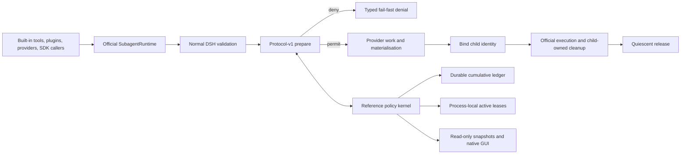

# dsh-subagent-admission

[简体中文](README.zh-CN.md)

An experimental shared lifecycle admission protocol and reference policy
kernel for [DeepSeek Harness](https://github.com/deepseek-ai/deepseek-harness)
subagents.

This project addresses the failure shape reported in
[Discussion #131](https://github.com/deepseek-ai/deepseek-harness/discussions/131):
nested subagents can expand until one Web host becomes unresponsive. It does
not add another orchestrator. It makes the decision to create or reactivate a
subagent explicit, atomic, and lifecycle-owned across every caller that uses
the official runtime.

> **Release-candidate status:** `0.1.0-rc.1` is a local, unpublished candidate.
> This is an independent community project. It is not an official DeepSeek
> component, has not been endorsed or adopted by DeepSeek, and is not proven
> in production.

## Why a shared protocol

Existing DSH plugins already solve useful local problems. For example,
`dsh-background-agents` limits starts made through its own tool, serialises
those starts per parent, and counts existing continuable children. AgentTeams
limits members inside a team, while Delegate gates declared dependencies.
Those are real precedents, not gaps to erase.

The remaining infrastructure problem is different: a tool-local lock cannot
atomically govern starts made at the same time by built-in tools, other
plugins, providers, SDK callers, or direct `ctx.subagents` calls. A host-wide
capacity rule also needs to cover one-shot and continuable work, cold resume,
and the official cleanup boundary. The current primary-source comparison is
recorded in [the ecosystem audit](compatibility/ecosystem-audit.md).

This repository therefore ships two deliberately separate pieces:

- a minimal, optional **protocol-v1 runtime seam** that asks for admission
  before provider work or child materialisation and reports bind/release
  lifecycle edges;
- an external **reference policy kernel** implementing atomic global/root
  active capacity, durable root/parent cumulative quotas, ownership recovery,
  typed denials, telemetry, and a read-only native GUI.

The official-facing contribution is the small protocol. The larger plugin is
one policy implementation and conformance vehicle, not a request to move its
whole product surface into DSH core.

## Honest operating modes

| Mode | Runtime | Behaviour |
| --- | --- | --- |
| **Audit** | Stock npm `@deepseek-ai/dsh-subagent@0.1.0-rc.6` | Observes and explains activity. It never claims to block a start. |
| **Strict** | Exact patched source target `47f943859bef60e4160492346772ded9b24f765a` / source package `0.1.0-rc.5` | Registers protocol v1 and enforces all-or-nothing admission before provider work. |
| **Unavailable** | Any unverified or incomplete Strict environment | Fails closed instead of silently degrading to Audit or stock behaviour. |

Package semver and method presence are not enough to select Strict. The exact
source identity, protocol version, patch hash, storage/bootstrap state, and
single-process ownership guard must all match. See
[compatibility](docs/compatibility.md).

## Policy semantics

v0.1 is queue-free and fail-fast. Defaults are startup configuration, not GUI
controls:

| Limit | Default | Meaning |
| --- | ---: | --- |
| Global active | 6 | Live subagent activations in this DSH process |
| Per-root active | 4 | Live activations owned by one durable root conversation |
| Per-root admitted total | 24 | New children accepted after that root enters coverage |
| Per-parent admitted children | 8 | New direct children accepted from one parent after coverage |

New one-shot and continuable children consume active and cumulative capacity.
A cold resume consumes active capacity without consuming cumulative quota
again. A resident follow-up reuses its activation and consumes nothing new.
An accepted permit remains held until the official runtime reaches quiescent
cleanup; result settlement alone is not release evidence.

There is no wait queue, priority, pre-emption, force release, quota reset, or
GUI mutation path in v0.1.

## Build and install the candidate

Prerequisites: Node `^22.19.0 || >=24.0.0` and pnpm `11.7.0`.

```bash
pnpm install --frozen-lockfile
pnpm pack:plugin
pnpm exec dsh plugin --profile web add \
  "$(pwd)/dist/dsh-subagent-admission-0.1.0-rc.1.tgz"
```

The bundle defaults to Audit. This command does not make stock DSH enforce
capacity. Strict is intentionally limited to the exact source target and
reference patch documented in [the upstream seam proposal](docs/upstream-seam.md):

`patches/dsh-subagent-admission-seam.patch` SHA-256:
`1340a9ffabde8310f68a7d66c4dacecda5dba263dd51666740801f5ec2c69135`.

```bash
# Prove the fixture is red against the unpatched target.
pnpm exec tsx scripts/verify-seam-patch.mts --expect-unpatched-failure

# Apply and verify protocol v1 in a disposable exact-target worktree.
pnpm exec tsx scripts/verify-seam-patch.mts
```

Neither command calls a model. Installing a tarball, receiving HTTP 200, or
rendering the GUI is not model/API, production, adoption, or official-acceptance
evidence.

## Architecture



The protocol never receives prompts, model output, tool arguments, provider
objects, `Agent` instances, credentials, or disposal authority. Detailed
invariants and ownership boundaries are in [architecture](docs/architecture.md).

## Native read-only GUI


The image is captured automatically at 1440×900 from an isolated, packed DSH
Web profile. It proves that the package boots in the native conversation UI,
preserves the Chat and Trajectory tabs, renders four quota cards and bounded
history, and exposes no mutation controls. It is automated local integration
and visual evidence only—not human review, model execution, production
deployment, or DeepSeek endorsement.

## Reproducible evidence

All generated machine evidence lives under ignored `evidence/`; the repository
tracks the producer, validator, and one promoted screenshot rather than
pretending one machine's JSON is universal proof.

```bash
pnpm baseline:check
pnpm lint
pnpm typecheck
pnpm test
pnpm test:e2e -- tests/packed-install.e2e.ts
pnpm release:evidence
pnpm release:evidence:check
```

The release evidence collector produces and validates:

- exact-target Strict plus stock Audit conformance;
- JSON and SQLite crash/restart persistence fixtures;
- packed Audit/Strict installation and native GUI capture;
- raw admission timing samples with environment identity;
- a bounded, no-model structural reproduction of #131;
- a hash-bound manifest covering source fingerprint, patch, package, client
  bundle, reports, and promoted screenshot.

See [reproduction](docs/reproduction.md) for the safety boundary. GitHub Actions
is configured for Linux Node 22.19/24 and macOS/Windows Node 24 smoke checks,
but configuration is not a claim that CI has executed on an unpublished
branch. Local and remote evidence remain separate.

## Boundaries

- Correctness is for one cooperative DSH host process. There is no
  multi-process, multi-host, or distributed lock.
- This is admission control, not OS process isolation, memory sandboxing,
  provider rate limiting, token budgeting, scheduling, or orchestration.
- Audit observes; only an exact verified protocol-v1 target can enforce.
- Cumulative quota begins at an explicit safe bootstrap. Historical work is
  not reconstructed or invented.
- A malicious in-process plugin shares the host trust boundary and can corrupt
  the process; v0.1 does not sandbox peer plugins.
- The reference patch is a proposal and test vehicle, not an accepted upstream
  change.

## Project documents

- [Architecture and invariants](docs/architecture.md)
- [Compatibility matrix and upgrade gate](docs/compatibility.md)
- [Minimal upstream seam](docs/upstream-seam.md)
- [Novelty and ecosystem audit](compatibility/ecosystem-audit.md)
- [Safe #131 reproduction](docs/reproduction.md)
- [Security policy](SECURITY.md)
- [Third-party notices](THIRD_PARTY_NOTICES.md)
- [Changelog](CHANGELOG.md)

## License

MIT. See [LICENSE](LICENSE). DeepSeek Harness and other third-party components
retain their own licences and notices.
