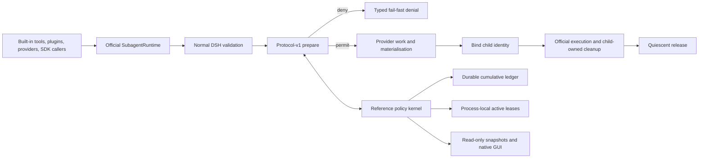
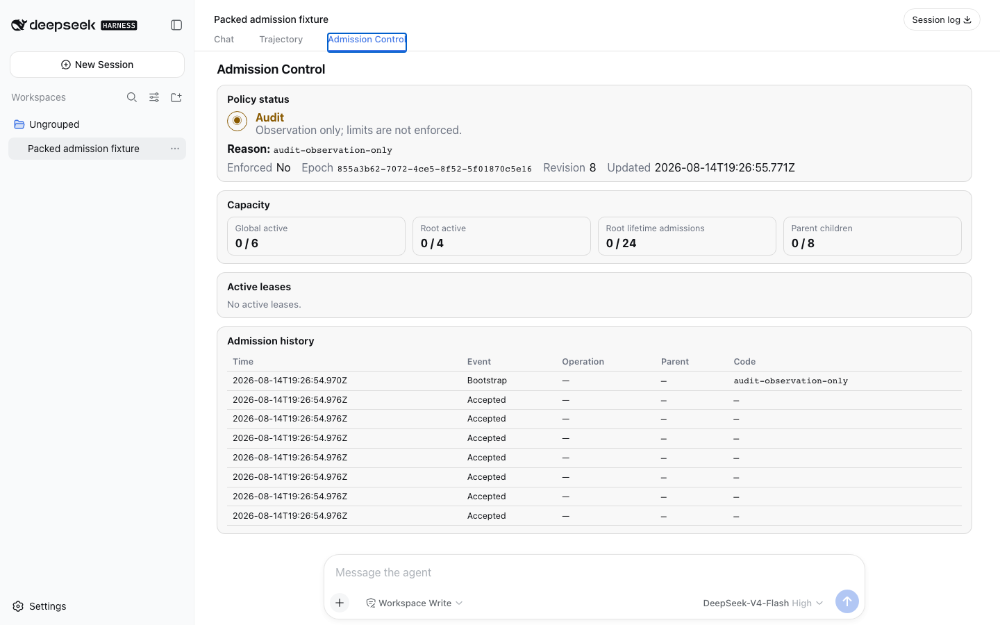

# dsh-subagent-admission

[简体中文](README.zh-CN.md)

[](https://github.com/yha9806/dsh-subagent-admission/actions/workflows/ci.yml)

An experimental shared lifecycle admission protocol and reference policy
kernel for [DeepSeek Harness](https://github.com/deepseek-ai/deepseek-harness)
subagents.

This project addresses the failure shape reported in
[Discussion #131](https://github.com/deepseek-ai/deepseek-harness/discussions/131):
nested subagents can expand until one Web host becomes unresponsive. It does
not add another orchestrator. It makes the decision to create or reactivate a
subagent explicit, atomic, and lifecycle-owned across every caller that uses
the official runtime.

The long-term product direction is an **Agent Runtime Resource Control Plane**:
every materialising agent workload should first acquire an explicit,
observable, lifecycle-owned resource permit. v0.1 deliberately tests only the
DSH subagent boundary.

> **Release-candidate status:** GitHub prerelease
> [`v0.1.0-rc.1`](https://github.com/yha9806/dsh-subagent-admission/releases/tag/v0.1.0-rc.1)
> is public, while the package is not published to npm. The focused upstream
> extension-point question is now public in
> [Discussion #131](https://github.com/deepseek-ai/deepseek-harness/discussions/131#discussioncomment-18020293).
> This remains an independent community project, not an official DeepSeek
> component. No DeepSeek endorsement or adoption, external-user evidence,
> production deployment, or maintainer response has been observed.

## Maintainer review path

The upstream decision is deliberately one question:

> Would an optional lifecycle-owned subagent admission capability belong as a
> documented extension point?

A bounded review can follow four artifacts:

- [Agent Note](docs/upstream-agent-note.md): the protocol-v1 Service Definition,
  Provider, Consumer, failure, and ownership contract;
- [slim seam](docs/upstream-seam.md): the exact three-file lifecycle integration,
  230 changed lines, and canonical patch identity;
- [reproduction](docs/reproduction.md): the bounded, no-model 56-request shape
  and its 56-to-4 provider-start result under Strict;
- [public CI](https://github.com/yha9806/dsh-subagent-admission/actions/runs/31831430355):
  exact-target conformance, crash recovery, packed installation, and native GUI
  evidence on the release commit.

The proposal does not ask DSH core to own quotas, policy, durable storage,
telemetry, or UI. Those remain external plugin concerns.

## Why a shared protocol

Existing DSH plugins already solve useful local problems. In particular,
[`dsh-turn-budget`](https://github.com/Nunchakus888/dsh-turn-budget) is an
immediately installable, fail-closed per-turn circuit breaker built entirely on
public `agent/pre-step` and `tools/pre-execute` hooks. It limits steps, tool
calls, and provider tokens. `dsh-background-agents` limits starts made through
its own tool, serialises those starts per parent, and counts existing
continuable children. AgentTeams limits members inside a team, while Delegate
gates declared dependencies. Those are real precedents, not gaps to erase.

`dsh-turn-budget` and this project address different layers and can compose:
the former bounds work within one turn on stock DSH; this experiment targets
atomic process/root admission shared by all callers and held through the
official child lifecycle. Neither should be presented as replacing the other.

The remaining infrastructure problem is different: a tool-local lock cannot
atomically govern starts made at the same time by built-in tools, other
plugins, providers, SDK callers, or direct `ctx.subagents` calls. A host-wide
capacity rule also needs to cover one-shot and continuable work, cold resume,
and the official cleanup boundary. The current primary-source comparison is
recorded in [the ecosystem audit](compatibility/ecosystem-audit.md).

This repository therefore separates three product layers:

- a narrow, optional **protocol-v1 admission contract** that asks for admission
  before provider work or child materialisation and reports bind/release
  lifecycle edges;
- an external **reference policy kernel** implementing atomic global/root
  active capacity, durable root/parent cumulative fuses, ownership recovery,
  and typed denials;
- an **operator and conformance surface** providing bounded telemetry, a
  read-only native GUI, exact-target tests, and release evidence.

The official-facing design question is the narrow protocol contract. The
current reference patch is a non-trivial lifecycle integration vehicle: 607
patch lines across three official files, with 187 changed lines in
`continuation.ts`. It is not a “tiny hook”, and the larger plugin is not a
request to move the whole product surface into DSH core.

## Honest operating modes

| Mode | Runtime | Behaviour |
| --- | --- | --- |
| **Audit** | Stock npm `@deepseek-ai/dsh-subagent@0.1.0-rc.6` | Observes and explains activity. It never claims to block a start or solve #131. |
| **Strict** | Exact patched source target `47f943859bef60e4160492346772ded9b24f765a` / source package `0.1.0-rc.5` | Registers protocol v1 and enforces all-or-nothing admission before provider work. |
| **Unavailable** | Any unverified or incomplete Strict environment | Fails closed instead of silently degrading to Audit or stock behaviour. |

Package semver and method presence are not enough to select Strict. The exact
source identity, protocol version, patch hash, storage/bootstrap state, and
single-process ownership guard must all match. See
[compatibility](docs/compatibility.md).

For an immediately installable stock-DSH turn circuit breaker, use
`dsh-turn-budget`. Strict lifecycle admission here currently requires the exact
experimental seam and should be evaluated as a reference implementation,
conformance system, and upstream design prototype—not a mature zero-patch
product.

## Policy semantics

v0.1 is queue-free and fail-fast. Defaults are startup configuration, not GUI
controls:

| Limit | Default | Meaning |
| --- | ---: | --- |
| Global active | 6 | Live subagent activations in this DSH process |
| Per-root active | 4 | Live activations owned by one durable root conversation |
| Per-root lifetime admitted total | 24 | Non-refundable new-child admissions after that root enters coverage |
| Per-parent admitted children | 8 | New direct children accepted from one parent after coverage |

New one-shot and continuable children consume active and cumulative capacity.
A cold resume consumes active capacity without consuming cumulative quota
again. A resident follow-up reuses its activation and consumes nothing new.
An accepted permit remains held until the official runtime reaches quiescent
cleanup; result settlement alone is not release evidence.

`perRootAdmittedTotal` is a mandatory positive, monotonic **lifetime fuse** in
v0.1. It is never refunded, disabled, reset, or aged out. A sufficiently
long-lived root will therefore reach 24 accepted children and remain denied
for new children. That is an intentional fail-fast safety boundary for this
bounded experiment, not a sustainable default for every long-running product.
Future product semantics should separate always-on active caps from an optional
lifetime fuse, epoch/window budgets, and audited offline reset or migration.
There is deliberately no ad-hoc GUI reset path.

There is no wait queue, priority, pre-emption, force release, or GUI mutation
path in v0.1.

## Build and install the candidate

Prerequisites: Node `^22.19.0 || >=24.0.0` and pnpm `11.7.0`.

```bash
pnpm install --frozen-lockfile
pnpm pack:plugin
pnpm exec dsh plugin --profile web add \
  "$(pwd)/dist/dsh-subagent-admission-0.1.0-rc.1.tgz"
```

The bundle defaults to Audit. This command does not make stock DSH enforce
capacity. Strict is intentionally limited to the exact source target and
verified seam patches documented in [the upstream seam proposal](docs/upstream-seam.md):

- **Canonical baseline patch (slim)** (`patches/dsh-subagent-admission-seam-slim.patch`):
  SHA-256 `1a3e351cab75ff22d55b0d2a8cb458cbee2794a769cb2f433e105dd421636073`
  (promoted canonical baseline, 230 changed lines, 455 serialized lines)
- **Recoverable reference patch** (`patches/dsh-subagent-admission-seam.patch`):
  SHA-256 `1340a9ffabde8310f68a7d66c4dacecda5dba263dd51666740801f5ec2c69135`
  (retained recoverable reference artifact, 418 changed lines, 607 serialized lines)

```bash
# Prove the fixture is red against the unpatched target.
pnpm exec tsx scripts/verify-seam-patch.mts --expect-unpatched-failure

# Apply and verify the canonical slim baseline patch in a disposable exact-target worktree.
pnpm exec tsx scripts/verify-seam-patch.mts --patch slim

# Apply and verify the recoverable reference patch in a disposable exact-target worktree.
pnpm exec tsx scripts/verify-seam-patch.mts --patch reference
```

Neither command calls a model. Installing a tarball, receiving HTTP 200, or
rendering the GUI is not model/API, production, adoption, or official-acceptance
evidence.

## Architecture



The protocol never receives prompts, model output, tool arguments, provider
objects, `Agent` instances, credentials, or disposal authority. Detailed
invariants and ownership boundaries are in [architecture](docs/architecture.md).

## Native read-only GUI



The image is captured automatically at 1440×900 from an isolated, packed DSH
Web profile. It proves that the package boots in the native conversation UI,
preserves the Chat and Trajectory tabs, renders four quota cards and bounded
history, and exposes no mutation controls. It is automated local integration
and visual evidence only—not human review, model execution, production
deployment, or DeepSeek endorsement.

## Reproducible evidence

All generated machine evidence lives under ignored `evidence/`; the repository
tracks the producer, validator, and one promoted screenshot rather than
pretending one machine's JSON is universal proof.

```bash
pnpm baseline:check
pnpm lint
pnpm typecheck
pnpm test
pnpm test:e2e -- tests/packed-install.e2e.ts
pnpm release:evidence
pnpm release:evidence:check
```

The release evidence collector produces and validates:

- exact-target Strict plus stock Audit conformance;
- JSON and SQLite crash/restart persistence fixtures;
- packed Audit/Strict installation and native GUI capture;
- raw admission timing samples with environment identity;
- a bounded, no-model structural reproduction of #131;
- a hash-bound manifest covering source fingerprint, patch, package, client
  bundle, reports, and promoted screenshot.

See [reproduction](docs/reproduction.md) for the safety boundary. GitHub Actions
runs Linux Node 22.19/24 and macOS/Windows Node 24 checks in the public source
repository. The badge and linked workflow runs are remote evidence; workflow
configuration and local results alone are not. npm publication, production use,
DeepSeek adoption, and maintainer response remain separate gates.

## Boundaries

- Correctness is for one cooperative DSH host process. There is no
  multi-process, multi-host, or distributed lock.
- This is admission control, not OS process isolation, memory sandboxing,
  provider rate limiting, token budgeting, scheduling, or orchestration.
- Audit observes; only an exact verified protocol-v1 target can enforce.
- Cumulative quota begins at an explicit safe bootstrap. Historical work is
  not reconstructed or invented, and the v0.1 lifetime fuse never resets.
- A malicious in-process plugin shares the host trust boundary and can corrupt
  the process; v0.1 does not sandbox peer plugins.
- The current patched Strict path is a proposal and test vehicle, not an
  accepted upstream change or sustainable install shape. A documented,
  zero-patch Strict extension point is the productization gate.

## Upstream design package

To propose this optional lifecycle-owned admission capability to DeepSeek Harness maintainers without requesting core inclusion of plugin policy or UI, this repository provides:

- [Proposed Agent Note](docs/upstream-agent-note.md) — formal Service Definition / Provider / Consumer specification of `registerAdmissionPolicy(policy)` and protocol v1;
- [Published Discussion #131 reply source](docs/discussion-131-draft.md) — the evidence-first source of the authorized public reply asking one focused extension-point question;
- [Experimental upstream seam](docs/upstream-seam.md) — detailed call-site analysis and dual-patch qualification data;
- Verified patches: canonical slim baseline (`patches/dsh-subagent-admission-seam-slim.patch`) and recoverable reference (`patches/dsh-subagent-admission-seam.patch`).

> **Note on external boundaries:** The tracked Discussion source now matches the authorized public reply. It does not authorize follow-up comments. No maintainer reply, official PR submission, or adoption has occurred. The architecture maintains an 80% protocol/policy kernel and 20% native GUI split: the GUI is an operator surface, not the product boundary. Zero-patch Strict remains the ultimate productization gate.

## Project documents

- [Architecture and invariants](docs/architecture.md)
- [Compatibility matrix and upgrade gate](docs/compatibility.md)
- [Experimental upstream seam](docs/upstream-seam.md)
- [Proposed upstream Agent Note](docs/upstream-agent-note.md)
- [Published Discussion #131 reply source](docs/discussion-131-draft.md)
- [Novelty and ecosystem audit](compatibility/ecosystem-audit.md)
- [Safe #131 reproduction](docs/reproduction.md)
- [Security policy](SECURITY.md)
- [Third-party notices](THIRD_PARTY_NOTICES.md)
- [Changelog](CHANGELOG.md)

## License

MIT. See [LICENSE](LICENSE). DeepSeek Harness and other third-party components
retain their own licences and notices.
