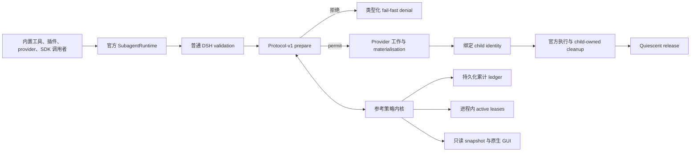

# dsh-subagent-admission

[English](README.md)

[](https://github.com/yha9806/dsh-subagent-admission/actions/workflows/ci.yml)

面向 [DeepSeek Harness](https://github.com/deepseek-ai/deepseek-harness)
子代理的实验性**共享生命周期准入协议与参考策略内核**。

本项目针对官方仓库
[Discussion #131](https://github.com/deepseek-ai/deepseek-harness/discussions/131)
报告的故障形态：嵌套子代理可以持续扩张，直至一个 Web Host 失去响应。
它不是另一个编排器，而是把“是否允许创建或重新激活子代理”变成所有官方
runtime 调用者共同经过的、原子的、由真实生命周期持有的决策。

长期产品方向是 **Agent Runtime Resource Control Plane**：每个即将实体化的
agent workload 都应先获得一个显式、可观察、由真实生命周期持有的资源 permit。
v0.1 只验证 DSH subagent 这一条极窄边界。

> **候选版本状态：** 源码已公开在
> [`yha9806/dsh-subagent-admission`](https://github.com/yha9806/dsh-subagent-admission)，
> 但 `0.1.0-rc.1` 尚未发布到 npm。这是独立社区项目，不是 DeepSeek 官方组件，
> 没有 DeepSeek 背书或采纳、外部用户证据、生产部署或 maintainer 回复。

## 为什么需要共享协议

现有 DSH 插件已经解决了一些真实问题。尤其是
[`dsh-turn-budget`](https://github.com/Nunchakus888/dsh-turn-budget)：它完全使用
公开的 `agent/pre-step` 与 `tools/pre-execute` hooks，提供可以立即安装、
fail-closed 的 per-turn circuit breaker，限制 step、tool call 和 provider token。
`dsh-background-agents` 会限制由它自己的工具发起的启动、按 parent 串行化这些
启动，并统计已有 continuable children；AgentTeams 限制团队成员数量；Delegate
对显式依赖进行门控。这些都是应该承认的前例，而不是可以抹掉的空白。

`dsh-turn-budget` 与本项目处在不同层，且可以组合：前者在原版 DSH 上约束单个
turn 内的工作；本实验针对所有调用者共享、由官方 child lifecycle 持有的原子
process/root admission。两者都不应被描述成取代对方。

剩余的 infra 问题不同：工具内部的锁无法原子约束同时由内置工具、其他插件、
provider、SDK 或直接 `ctx.subagents` 调用发起的启动。Host 级容量规则还必须
覆盖 one-shot、continuable、cold resume 和官方 cleanup 边界。当前逐项主源
比较记录在[生态审计](compatibility/ecosystem-audit.md)中。

因此本仓库明确分成三层：

- 一个窄而可选的 **protocol-v1 admission contract**：在 provider 工作或 child
  materialisation 前请求准入，并报告 bind/release 生命周期边；
- 一个外置的**参考策略内核**：实现原子的 global/root active 容量、持久化的
  root/parent 累计 fuse、所有权恢复和类型化拒绝；
- 一个 **operator 与 conformance surface**：提供有界遥测、只读原生 GUI、
  精确目标测试和发布证据。

面向官方的是这个窄协议设计问题。当前 reference patch 是非平凡 lifecycle
integration 载体：涉及 3 个官方文件、607 行 patch，其中 `continuation.ts`
有 187 行变更。它不是“十几行 hook”；完整插件也不是要求把整个产品表面搬进
DSH core。

## 真实的运行模式

| 模式 | Runtime | 行为 |
| --- | --- | --- |
| **Audit** | npm 原版 `@deepseek-ai/dsh-subagent@0.1.0-rc.6` | 观察和解释活动，绝不声称能够阻止启动或解决 #131。 |
| **Strict** | 精确 patched source target `47f943859bef60e4160492346772ded9b24f765a` / source package `0.1.0-rc.5` | 注册 protocol v1，在 provider 工作前执行全有或全无的准入。 |
| **Unavailable** | 任何未经验证或条件不完整的 Strict 环境 | fail closed，不静默降级为 Audit 或原版行为。 |

仅有 semver 或方法存在不够。精确 source identity、protocol version、patch
hash、storage/bootstrap 状态和单进程 ownership guard 必须全部匹配。详见
[兼容性说明](docs/compatibility.md)。

若需要可以立即安装在原版 DSH 上的 turn circuit breaker，应使用
`dsh-turn-budget`。这里的 Strict lifecycle admission 目前要求精确 experimental
seam，应被视为 reference implementation、conformance system 与 upstream design
prototype，而不是成熟的 zero-patch 产品。

## 策略语义

v0.1 没有队列，采用 fail-fast。默认值来自启动配置，GUI 不可修改：

| 限制 | 默认值 | 含义 |
| --- | ---: | --- |
| Global active | 6 | 当前 DSH 进程中的 live subagent activations |
| Per-root active | 4 | 一个持久化 root conversation 拥有的 live activations |
| Per-root lifetime admitted total | 24 | root 进入 coverage 后不可退款的新 child admission 总数 |
| Per-parent admitted children | 8 | coverage 后一个 parent 允许的新 direct children 总数 |

新的 one-shot 和 continuable child 同时消耗 active 与累计容量。Cold resume
只重新消耗 active，不再次消耗累计配额；resident follow-up 复用已有 activation，
不新增消耗。已经接受的 permit 会一直持有到官方 runtime 达到 quiescent
cleanup；仅仅返回 result 不是释放证据。

`perRootAdmittedTotal` 在 v0.1 中是必须为正、单调递增的 **lifetime fuse**。
它不会退款、关闭、重置或随时间老化。一个长期存在的 root 最终会达到 24 个
accepted children，此后永久拒绝新的 child。这是当前有界实验中有意的 fail-fast
安全边界，不是适合所有长期产品的默认语义。后续产品应把 always-on active cap、
optional lifetime fuse、epoch/window budget，以及经过审计的 offline reset 或
migration 分开；不能增加一个随手可点的 GUI reset。

v0.1 不提供等待队列、优先级、抢占、强制释放或 GUI 写操作。

## 构建和安装候选包

前置要求：Node `^22.19.0 || >=24.0.0`，pnpm `11.7.0`。

```bash
pnpm install --frozen-lockfile
pnpm pack:plugin
pnpm exec dsh plugin --profile web add \
  "$(pwd)/dist/dsh-subagent-admission-0.1.0-rc.1.tgz"
```

bundle 默认是 Audit。这个命令不会让原版 DSH 获得容量 enforcement。Strict
只适用于[实验性 upstream seam 提案](docs/upstream-seam.md)中记录的精确 source
target 和已验证的 seam patches：

- **Canonical 基准补丁（slim）** (`patches/dsh-subagent-admission-seam-slim.patch`)：
  SHA-256 `b29860806eb446dc4df1789565c26192b808d638cf404b237c447df10f75c215`
  （已晋升为 canonical 基准，225 行变更，448 行序列化补丁）
- **可恢复的 Reference 补丁** (`patches/dsh-subagent-admission-seam.patch`)：
  SHA-256 `1340a9ffabde8310f68a7d66c4dacecda5dba263dd51666740801f5ec2c69135`
  （保留的可恢复 reference 工件，418 行变更，607 行序列化补丁）

```bash
# 证明 fixture 在未打 patch 的目标上是 RED。
pnpm exec tsx scripts/verify-seam-patch.mts --expect-unpatched-failure

# 在一次性精确目标 worktree 中应用并验证 canonical slim 基准补丁。
pnpm exec tsx scripts/verify-seam-patch.mts --patch slim

# 在一次性精确目标 worktree 中应用并验证可恢复的 reference 补丁。
pnpm exec tsx scripts/verify-seam-patch.mts --patch reference
```

这些命令都不会调用模型。安装 tarball、收到 HTTP 200 或渲染 GUI，都不是
模型/API、生产部署、采用或官方接受的证据。

## 架构



协议不会接收 prompt、模型输出、tool arguments、provider 对象、`Agent`、
credentials 或 disposal authority。详细不变量见[架构说明](docs/architecture.md)。

## 原生只读 GUI


该图片由隔离的 packed DSH Web profile 在 1440×900 自动截取。它证明 package
能在原生 conversation UI 中启动、保留 Chat 与 Trajectory tabs、渲染四张
quota cards 和有界历史，并且没有 mutation controls。它只是自动化本地集成
与视觉证据，不是人工评审、模型运行、生产部署或 DeepSeek 背书。

## 可复现证据

机器生成的证据放在被忽略的 `evidence/`。仓库跟踪 producer、validator 和一张
晋升后的截图，而不把某一台机器的 JSON 冒充成普适证明。

```bash
pnpm baseline:check
pnpm lint
pnpm typecheck
pnpm test
pnpm test:e2e -- tests/packed-install.e2e.ts
pnpm release:evidence
pnpm release:evidence:check
```

release evidence collector 会生成并校验：

- 精确目标 Strict 与原版 Audit conformance；
- JSON 和 SQLite crash/restart persistence fixtures；
- packed Audit/Strict 安装和原生 GUI capture；
- 带环境身份的原始 admission timing samples；
- 对 #131 的有界、无模型结构复现；
- 绑定 source fingerprint、patch、package、client bundle、reports 和晋升截图
  的 hash manifest。

安全边界见[复现说明](docs/reproduction.md)。公开源码仓库中的 GitHub Actions
运行 Linux Node 22.19/24 与 macOS/Windows Node 24 检查；badge 和链接中的
workflow runs 才是远端证据，仅有 workflow 配置或本地结果不是。npm 发布、
生产使用、DeepSeek 采纳与 maintainer 回复仍是彼此独立的 gates。

## 明确边界

- 正确性范围是一个 cooperative DSH host process；没有多进程、多 host 或
  distributed lock。
- 这是 admission control，不是 OS process isolation、内存沙箱、provider
  rate limit、token budget、调度或编排。
- Audit 只能观察；只有精确验证的 protocol-v1 target 才能 enforce。
- 累计配额从明确的安全 bootstrap 开始，不重建或虚构历史工作；v0.1 的
  lifetime fuse 永不重置。
- 恶意的进程内插件处在同一 Host trust boundary；v0.1 不隔离 peer plugins。
- 当前 patched Strict 是提案和测试载体，不是 upstream 已接受的修改或可持续
  安装形态。形成 documented、zero-patch 的 Strict extension point 才是产品化 Gate。

## Upstream 设计包

为了向 DeepSeek Harness maintainers 提议这一可选的生命周期准入能力（且不要求 core 包含插件的策略与 UI），本仓库提供：

- [提议的 Agent Note](docs/upstream-agent-note.md) — 关于 `registerAdmissionPolicy(policy)` 与 protocol v1 的正式 Service Definition / Provider / Consumer 规范；
- [Discussion #131 讨论草案](docs/discussion-131-draft.md) — 紧凑（150–180 词）、以证据为先的草案，仅提出一个聚焦的扩展点设计问题；
- [实验性 upstream seam](docs/upstream-seam.md) — 详细的 call-site 分析与双 patch 验证数据；
- 验证补丁：canonical slim 基准 (`patches/dsh-subagent-admission-seam-slim.patch`) 与可恢复 reference (`patches/dsh-subagent-admission-seam.patch`)。

> **外部边界说明：** 跟踪 Discussion 草案不构成发布授权。未收到 maintainer 回复、未提交官方 PR，亦无官方采纳。架构始终保持 80% 协议与策略内核 / 20% 原生 GUI 的分工：GUI 是操作员观察界面，绝非产品边界。Zero-patch Strict 始终是最终产品化门禁。

## 项目文档

- [架构与不变量](docs/architecture.md)
- [兼容矩阵与升级 gate](docs/compatibility.md)
- [实验性 upstream seam](docs/upstream-seam.md)
- [提议的 upstream Agent Note](docs/upstream-agent-note.md)
- [Discussion #131 草案](docs/discussion-131-draft.md)
- [新颖性与生态审计](compatibility/ecosystem-audit.md)
- [安全复现 #131](docs/reproduction.md)
- [安全策略](SECURITY.md)
- [第三方声明](THIRD_PARTY_NOTICES.md)
- [变更记录](CHANGELOG.md)

## License

MIT，详见 [LICENSE](LICENSE)。DeepSeek Harness 和其他第三方组件保留各自的
license 与 notices。
