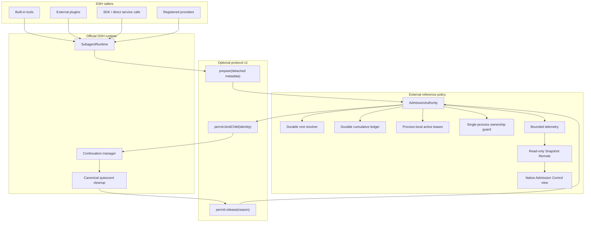
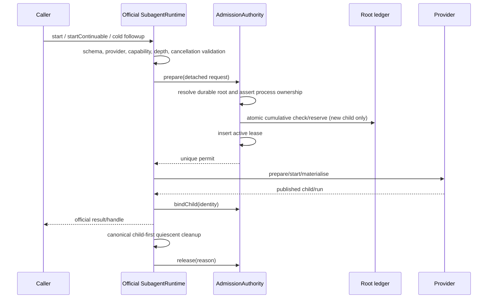

# Architecture: shared lifecycle admission

## 1. Positioning

`dsh-subagent-admission` is an external reference policy kernel for one
DeepSeek Harness Host process. The official-facing proposal is a much smaller
protocol-v1 seam in `SubagentRuntime`.

The distinction is intentional:

- **DSH core owns lifecycle:** provider validation, provider execution,
  `Agent` construction, child publication, continuation routing, interruption,
  descendant teardown, and final disposal.
- **The protocol communicates ownership edges:** prepare, bind child, release.
- **The external policy owns admission:** root resolution, limits, atomic
  reservation, durable cumulative accounting, active leases, telemetry, and
  operator-facing read-only state.

This is not a second runtime, a scheduler, a generic orchestration layer, or a
process sandbox.

## 2. Why the seam belongs in the runtime

DSH deliberately encourages plugins, and plugins can create children through
different tools and services. A limiter inside one plugin can govern only the
calls that cooperate with that limiter. It may count children created by other
callers after they exist, but it cannot atomically prevent a simultaneous
direct runtime call from creating another child.

The shared seam sits after ordinary request/provider validation and before any
provider preparation or materialisation. Consequently every built-in tool,
plugin, provider adapter, SDK path, and direct service caller that converges on
`SubagentRuntime` receives the same decision without integrating a second
plugin API.

This is the residual contribution after accounting for existing local caps in
`dsh-background-agents`, AgentTeams, and related plugins. See
[`compatibility/ecosystem-audit.md`](../compatibility/ecosystem-audit.md).

## 3. Component map



## 4. Protocol-v1 contract

The reference patch adds an explicit
`SubagentRuntime.admissionProtocolVersion === 1` and one effect-scoped method:

```ts
runtime.registerAdmissionPolicy(policy)
```

Only one protocol-v1 policy may register. Registration is optional and stock
behaviour is unchanged when no policy exists. Once a registered policy is
unloaded, admission is tombstoned for that runtime: new requests fail with
`ADMISSION_CLOSED`, while existing permit closures remain usable during drain.
A fresh runtime is required to return to policy-absent stock behaviour.

The request contains detached operational metadata only:

- request correlation ID;
- operation: `new-one-shot`, `new-continuable`, or `cold-resume`;
- provider name;
- durable parent session ID;
- reserved/existing child session ID when known.

It does not carry prompts, messages, tool arguments, results, model output,
credentials, provider objects, `Agent`/`AgentHandle` references, asserted root
identity, or a disposal capability.

An accepted request returns a unique permit with two edges:

```ts
permit.bindChild({ childSessionId, localParentSessionId? })
await permit.release(reason)
```

Binding is at most once and root ownership is immutable. Release is idempotent
but only the official lifecycle owner decides when cleanup is complete.

## 5. Operation semantics

| Operation | Active checks | Root cumulative | Parent cumulative | New permit |
| --- | --- | --- | --- | --- |
| New one-shot | Global + root | Check and increment | Check and increment | Yes |
| New continuable | Global + root | Check and increment | Check and increment | Yes |
| Cold resume | Global + root | No change | No change | Yes |
| Resident follow-up | Covered by resident activation | No change | No change | No |
| Quiescent release | Decrement global + root | No change | No change | Releases existing permit |
| Denial | Check only | No change | No change | No |

Foreground/background and spawn/fork do not change this table. They describe
calling and provider behaviour, not Host resource ownership.

## 6. Decision and ownership sequence



The new-child linearisation point is the durable ledger reservation plus
non-throwing active lease insertion in one serialised critical section. A cold
resume inserts only an active lease. Internal transaction serialisation is not
a capacity queue: a caller may briefly wait for an in-flight mutation, but it
never waits for capacity to become available.

Provider or materialisation failure after successful admission does not refund
cumulative quota. The active lease releases only after partial resources have
been cleaned. This prevents retry storms from bypassing total limits.

## 7. Limits and deterministic failures

Defaults:

- global active: 6;
- per-root active: 4;
- per-root admitted total: 24;
- per-parent admitted children: 8.

The check order is stable:

1. normal DSH validation;
2. protocol and lifecycle state;
3. durable lineage/bootstrap safety;
4. root admitted total;
5. parent admitted children;
6. root active;
7. global active;
8. atomic reservation.

Permanent cumulative failures precede transient active failures. The public
error vocabulary is exactly:

- `ADMISSION_UNAVAILABLE`;
- `ADMISSION_CLOSED`;
- `ADMISSION_STATE_IO`;
- `ADMISSION_BINDING_CONFLICT`;
- `ROOT_TOTAL_LIMIT`;
- `PARENT_CHILD_LIMIT`;
- `ROOT_ACTIVE_LIMIT`;
- `GLOBAL_ACTIVE_LIMIT`.

A denial contains only bounded detached diagnosis fields. Telemetry and GUI
history are never authoritative inputs to a decision.

## 8. Durable state and restart

The root ledger stores post-coverage cumulative counters and immutable parent
ownership. JSON and SQLite storage-domain backends implement the same contract.
Process-local active leases are deliberately not restored after a process
crash: dead process residency is not live capacity.

Strict bootstrap therefore requires:

- the exact verified protocol target;
- storage-domain availability;
- one acquired ownership guard for the configured ledger namespace;
- readable, acyclic, non-conflicting durable lineage;
- no pre-existing live subagent activation that escaped coverage.

If any condition cannot be proved, mode is `unavailable`, not partially
enforcing. Crash fixtures kill the exact child process after durable commit and
verify that cumulative quota survives while active leases reset to zero.

## 9. Audit, Strict, and Unavailable

Audit and Strict are not confidence labels; they are different capabilities.

- **Audit** installs on stock DSH, observes official lifecycle events, and
  exposes `enforced: false` with reason `audit-observation-only`.
- **Strict** registers the versioned policy only on an exact verified source
  target and reports `enforced: true`.
- **Unavailable** is the only result of a requested Strict configuration whose
  protocol, identity, storage, ownership, or bootstrap cannot be proved.

There is no monkey patch, provider wrapping, tool interception, or best-effort
Strict fallback.

## 10. Read-only observability

The Host exposes only `snapshot/get` and `snapshot/watch`. The client registers
one native conversation tab and renders:

- exact mode/enforced/reason state;
- policy epoch and revision;
- four current usage/limit cards;
- active leases;
- bounded admission history and dropped-event count.

There are no kill, reset, release, retry, quota-edit, or configuration controls.
The GUI is evidence that the kernel composes with native DSH surfaces; it is
not the enforcement boundary.

## 11. Security and correctness invariants

For every reachable Strict state:

1. global and per-root active counts do not exceed configured limits;
2. governed root and parent cumulative counters do not exceed their limits;
3. every active activation owns exactly one unreleased permit;
4. every permit belongs to one root and at most one child activation;
5. new-child cumulative accounting happens exactly once and is never refunded;
6. denial changes no authoritative state and starts no provider work;
7. cold resume changes active capacity only;
8. resident follow-up creates no permit;
9. release occurs exactly once after quiescent cleanup;
10. root binding is immutable and agrees with durable ancestry;
11. unprovable lineage or ownership fails closed;
12. policy unload closes new admission synchronously before drain.

Property tests exercise the state model; contract and E2E tests exercise
storage, composition, crash recovery, protocol boundaries, packed installation,
and the GUI. Tests are evidence for the tested environments, not proof of all
deployments or official acceptance.

## 12. Non-goals and accepted limits

v0.1 does not provide:

- multi-process, multi-host, or distributed correctness;
- OS process isolation, memory/CPU cgroups, or remote-compute ownership;
- protection against a malicious in-process peer plugin;
- a wait queue, fairness, priority, pre-emption, or scheduler;
- provider/API rate limiting, token, cost, or model budgeting;
- force kill, force release, or counter reset;
- generic DAG orchestration or task routing;
- reconstruction of historical admissions before safe coverage;
- proof of production deployment, adoption, official endorsement, or upstream
  acceptance.
